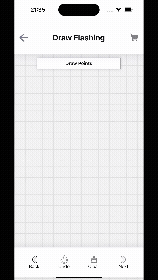

# react-native-board-svg

A React Native drawing board component that allows users to draw lines and modify measurements using SVG graphics. Perfect for creating interactive diagrams, sketches, and technical drawings with precise measurement controls.

## Features

- ️ Interactive Drawing: Draw lines and shapes directly on the canvas
- 📏 Measurement Tools: Add and modify measurements with precision
- 🎨 SVG-Based: Scalable vector graphics for crisp, resolution-independent drawings
- 📱 React Native Compatible: Works seamlessly on both iOS and Android
- 🔧 Customizable: Flexible styling and configuration options
- 🎯 Touch-Friendly: Optimized for mobile touch interactions

## Installation

```bash
npm install react-native-board-svg
```

### Dependencies

```bash
npm install react-native-svg
```

For iOS, you'll also need to run:

```bash
cd ios && pod install
```

This package requires the following peer dependencies

## Basic Usage

```typescript
import React from 'react';
import {Board, FLASHINGS_DATA} from 'react-native-board-svg';

const BoardFlashingScreen = () => {
  const handleOnSave = (data: FLASHINGS_DATA) => {
    console.log('dataFlashing on save', JSON.stringify(data));
  };
  return <Board onSave={handleOnSave} />;
};
export default BoardFlashingScreen;
```

## Props

| Prop     | Type       | Default | Description                                     |
| -------- | ---------- | ------- | ----------------------------------------------- |
| `onSave` | `function` | -       | Callback fired when user saves the drawing data |

## Data Structures

The onSave callback receives data in the following format:

```typescript
type Point = [number, number];

type DataLine {
  points: Point[];
  pending: number;
  distance: number;
  isLine: boolean;
}

type FLASHINGS_DATA {
  dataLines: DataLine[];
}
```

## Example Data Structure

```JSON
{
   "dataLines":[
      {
         "points":[
            [
               34,
               136
            ],
            [
               17,
               476
            ]
         ],
         "pending":-20,
         "distance":340,
         "isLine":true
      },
      {
         "points":[
            [
               17,
               476
            ],
            [
               238,
               476
            ]
         ],
         "pending":0,
         "distance":221,
         "isLine":true
      }
   ]
}
```

## Preview



# License

This project is licensed under the MIT License - see the LICENSE file for details.

# Support

- 🐛 Issues: [GitHub Issues](https://github.com/MatheoNieto/react-native-board-svg/issues)
